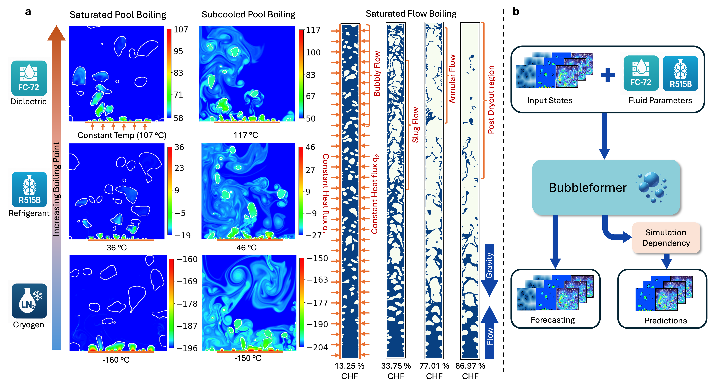

# Bubbleformer

A deep learning library for training foundation models on the [**BubbleML 2.0**](#bubbleml-20-dataset) dataset, focusing on boiling phenomena—an inherently chaotic, multiphase process central to energy and thermal systems. Bubbleformer is a transformer-based spatiotemporal model that forecasts stable and long-range boiling dynamics (including nucleation, interface evolution, and heat transfer) without dependence on simulation data during inference.


*Figure 1: Overview of BubbleML 2.0 dataset and Bubbleformer downstream tasks*

## Overview

Bubbleformer is a transformer-based model that learns to forecast full field boiling dynamics including temperature, velocity, and signed distance functions representing bubble interfaces, setting a new benchmark for ML-based boiling physics. The model makes three core contributions:

1. **Beyond prediction to forecasting**
   - Operates directly on full 5D spatiotemporal tensors while preserving temporal dependencies
   - Learns nucleation dynamics end-to-end, enabling long-range forecasting
   - Unlike prior models, requires no compressed time representations or injected future bubble positions

2. **Generalizing across fluids and flow regimes**
   - Conditions on thermophysical parameters for cross-scenario generalization
   - Handles diverse fluids (cryogenics, refrigerants, dielectrics)
   - Supports multiple boiling configurations (pool/flow boiling) and geometries (single/double-sided heaters)
   - Covers all flow regimes from bubbly to annular until dryout
   - Trained on [**BubbleML 2.0**](#bubbleml-20-dataset) - the most comprehensive boiling dataset to date

3. **Physics-based evaluation**
   - Introduces interpretable metrics beyond pixel-wise error:
     - Heat flux divergence
     - Eikonal PDE for signed distance functions
     - Mass conservation
   - Evaluates physical correctness in chaotic systems

It sets new benchmarks on both prediction and forecasting tasks in [**BubbleML 2.0**](#bubbleml-20-dataset), offering a significant step toward practical, generalizable ML surrogates for multiphase transport.

## Key Features

- Transformer-based architectures optimized for fluid dynamics prediction
- Support for axial vision transformers (AViT) with factored spacetime blocks
- Data handling for HDF5 BubbleML+ BubbleML 2.0 fluid dynamics datasets
- Training and inference pipelines with PyTorch Lightning
- Visualization tools for fluid dynamics predictions

## BubbleML 2.0 Dataset

BubbleML 2.0 significantly expands the original BubbleML dataset with new fluids, boiling configurations, and flow regimes, enabling comprehensive study of generalization across thermophysical conditions and geometries.

### Key Features

- **160+ high-resolution 2D simulations** spanning:
  - Pool boiling and flow boiling configurations
  - Diverse physics (saturated, subcooled, and single-bubble nucleation)
  - Three fluid types:
    - FC-72 (dielectric)
    - R-515B (refrigerant)
    - LN$_2$ (cryogen)

- **New experimental conditions**:
  - Constant heat flux boundary conditions
  - Double-sided heater configurations
  - Full range of flow regimes (bubbly, slug, annular until dryout)

### Technical Specifications

- **Simulation framework**: All simulations performed using Flash-X
- **Data format**: HDF5 files
- **Resolution**:
  - Spatial and temporal resolution varies by fluid based on characteristic scales
  - Adaptive Mesh Refinement (AMR) used where needed
  - AMR grids interpolated to regular grids with:
    1. Linear interpolation
    2. Nearest-neighbor interpolation for boundary NaN values

- **Contents**: Each simulation includes:
  - Temperature fields
  - Velocity components (x/y)
  - Signed distance functions (bubble interfaces)
  - Thermophysical parameters

For additional details on boundary conditions, numerical methods, and experimental validation, please refer to the bubbleformer paper Appendix B.

## Installation

### Using conda and pip

```bash
conda env create -f env/bubbleformer_gpu.yaml
conda activate bubbleformer
pip install -r env/requirements.txt
pip install -e .
```

## Repository Structure

```
.
├── bubbleformer/              # Main package directory
│   ├── config/                # Configuration files
│   │   ├── data_cfg/          # Dataset configurations
│   │   ├── model_cfg/         # Model configurations
│   │   ├── optim_cfg/         # Optimizer configurations
│   │   └── scheduler_cfg/     # Learning rate scheduler configurations
│   ├── data/                  # Data loading and processing modules
│   ├── layers/                # Model layer implementations
│   ├── models/                # Model architecture implementations
│   └── utils/                 # Utility functions (losses, plotting, etc.)
├── env/                       # Environment configuration files
├── examples/                  # Example notebooks
├── samples/                   # Sample data files
└── scripts/                   # Training and inference scripts
```

## Usage

### Training

To train a model using the default configuration:

```bash
python scripts/train.py
```

To train with a specific configuration:

```bash
python scripts/train.py data_cfg=poolboiling_saturated model_cfg=avit_small
```

### Inference

The repository provides two ways to run inference:

1. Using the Python script:
```bash
python scripts/inference.py --model_path /path/to/model --data_path /path/to/data
```

2. Using the Jupyter notebook:
```bash
jupyter notebook scripts/inference_autoregressive.ipynb
```

## Models

The primary models available in Bubbleformer are:

- **AViT** (Axial Vision Transformer): A transformer-based model with factored spacetime blocks
- **UNet** (Modern UNet): A UNet architecture for spatial-temporal prediction
